# Logitech G27 Wireless Pedals per ESP-NOW
Ich fahre nur gelegentlich ein paar Runden GT7 und hab dazu noch ein altes Logitech G27 Lenkrad mit Pedalen. Ich musste bereits den optischen Encoder reparieren und war vertraut damit das Lenkrad zu zerlegen. Um das G27 an einer PS5 lauffähig zu bekommen ist ein Adapter nötig, ich nutze den [Ras1ution 2](https://www.brookaccessory.com/products/ras1ution2/index.html) und bin soweit zufrieden, allerdings ist der mittlerweile so teuer dass man auch über ein neues kompatibles Lenkrad nachdenken könnte. 
Da ich mein Setup regelmäßig am Schreibtisch auf- und abbaue habe ich das optimiert. Lenkrad und Schalthebel sind auf einem laminierten Brett geschraubt und die Pedale haben Schienen mit denen ich den Abstand zum Bürostuhl fixieren kann. Das hat aber leider zu Folge dass die Leitungen am Lenkrad fest verbunden sind und beim aufräumen das Kabel zu den Pedalen sehr stört. Das Brett mit Lenkrad und Schalthebel ist quasi über das dünne Kabel mit den Pedalen fest verbunden. Warum also das ganze nicht schnurlos gestalten, die Elektronik hierfür habe ich daheim und ich war eh auf der Suche nach einem neuen Projekt? 
Das ist ein Blog oder Erfahrungsbericht, keine Anleitung. Grundkenntnisse in Elektronik und ESP sind vorausgesetzt. Gerne beantworte ich Fragen aber ich erhebe hier keinen Anspruch auf ein Projekt was problemlos nachgebaut werden kann.

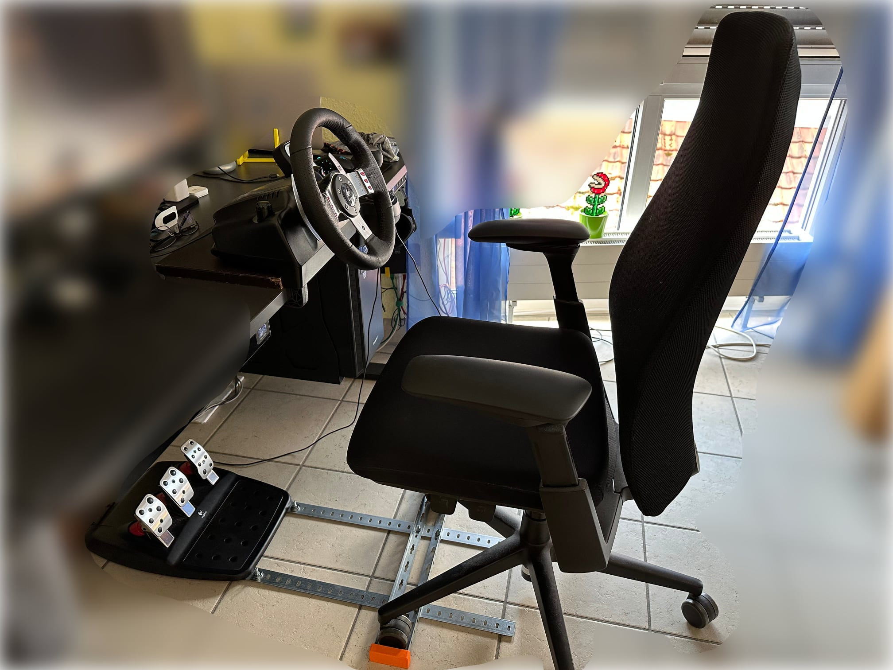 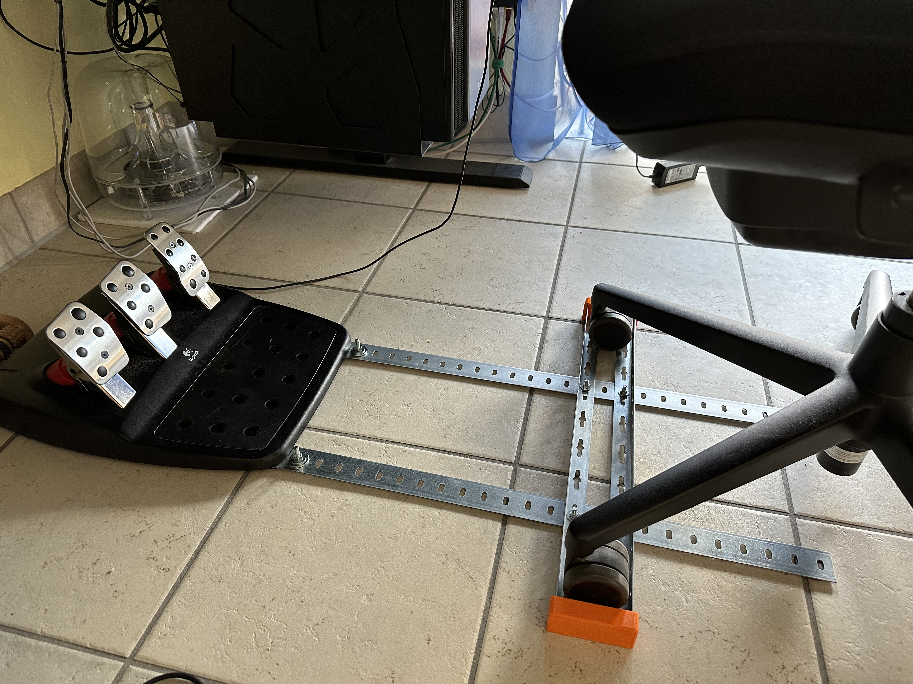

Die Kernelemente sind zwei ESP8622 Boards in Form eines ESP-01 und eines Wemos Klons. Stromversorgung beim Empfänger sollte im Lenkrad zu finden sein, für die Pedale brauchen wir eine Akku-Schaltung mit Ladeelektronik die lange genug durchhält. Eine 18650 Lithium Zelle ist üppig genug und sollte mit 2000mAh circa 11-12h durchhalten. Der Sender benötigt circa 120-150mA, aber zur Wahrheit gehört auch dass wir nicht die gesamte Kappazität der Batterie nutzen können weil unter 3V der ESP dann irgendwann aussteigt. Der Spannungsregler hat entsprechend auch einen Spannungsabfall von 0.1-0.2V. Ich habe mich an fertigen Breakout Boards bedient die ich dann auf einer Lochrasterplatine mit Kupferlackdrähten verbunden habe. Natürlich wäre das alles auf einer schicken Platine schöner aber ich hatte nicht geplant hiermit in die Serienfertigung zu. gehen, das Projekt ist für mich und ich Teile nur meine Erfahrungen falls jemand etwas ähnliches vor hat. 
Die Stücklliste der fertigen Boards:
* ESP-01 + Programmieradapter
* Spannungsregler 3.3V
* Ladeschaltung Li-Ion Akku
* USB-PD Board (optional)
* ADS1115 4-Kanal AD-Wandler mit I2C Bus
* Wemos Pro mini
* Levelshifter 3.3V <—> 5V
* I2C Display (optional)
* Lochrasterplatine
* Kupferlackdraht
* Steckverbinder (Set mit Crimpzange)
* 18650 Akkuzelle mit Halter
* Ein/Aus-Schalter
  
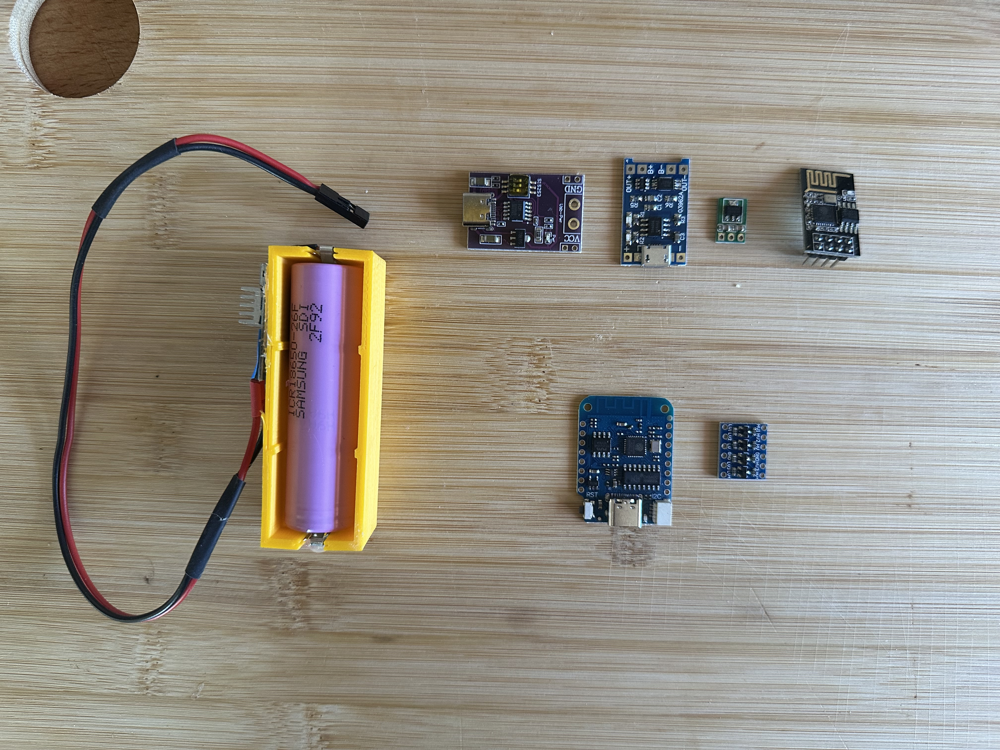

# Der Sender
Das USB-C PD-Board habe ich genommen weil damit sicher gestellt ist dass auch ein PD-Netzteil Spannung liefert und auch der maximale Ladestrom von 1A damit erreicht werden kann. Ohne dieses funktioniert die Ladeschaltung natürlich auch. Ich hatte aber nur Boards mit Micro-USB Buchse und ein PD-Netzteil würde auch keine Spannung liefern. Ein  USB-A Kabel auf Micro-USB würde funktionieren aber das wollte ich nicht. Ich bin froh wenn irgendwann alle meine Geräte nur noch USB-C benutzen. Deshalb der Aufwand mit dem PD-Breakout Board um mit den 5V dann direkt in das Ladeboard zu gehen. Ich habe hier eins mit Schutzschaltung genommen das vor Unterspannung und Kurzschlussstrom schützt.  Der Ausgang des Boards wird mit dem Spannungswandler verbunden an dem dann der ESP-01 und der ADS1115 angeschlossen wird. Der ESP-01 hat keinen AD Wandler und wir würden ja auch mindestens 3 benötigen, das bietet auch kein Wemos. Weiter ist der on-Board AD Wandler sehr ungenau und von der Versorgungsspannung abhängig. Das AD1115 Board liefert uns hingegen 4 AD-Wander mit eigener Referenzspannung, mit 16 Bit Auflösung und hoher Samplingrate von maximal 860 sps (bei 4 Kanälen entsprechend 860/4). Da bleibt auch noch ein Kanal frei um die Akkuspannung zu überwachen, das ist optional. Genauso wie das OLED Display am Empfänger kann man das auch einfach weglassen. 

 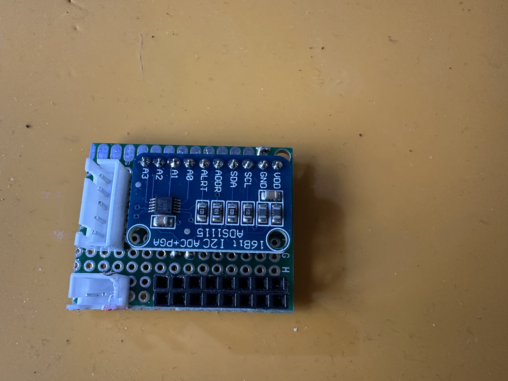 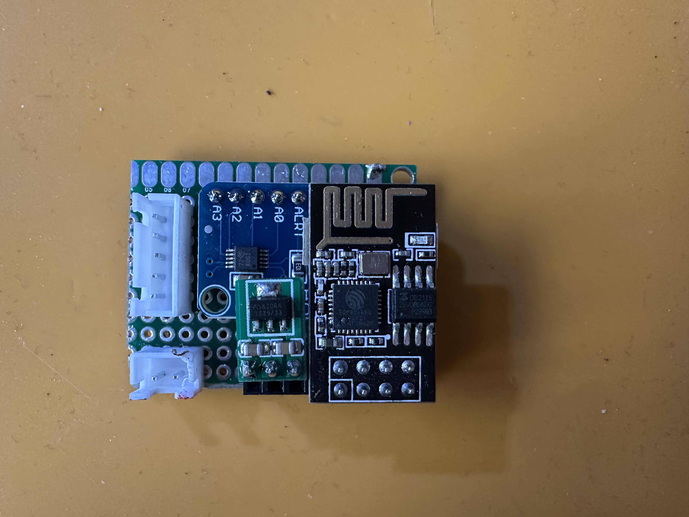 

Unter dem ADS1115 befindet sich ein einfach Spannungteiler für die Batteriespannung. Die gemessene Spannung darf nicht über den 3,3V VDD liegen und der Akku kann ja bis zu 4,2V haben. Deshalb kommt hier eine Reihenschaltung von 220kOhm und 100kOhm als Teiler.

Ubat —|100k|— A0 — |220k| — GND

Den ADS1115 habe ich ohne Stecksockel auf der Platine verlötet damit ich die Boards stapeln kann und die Fläche klein bleibt. 

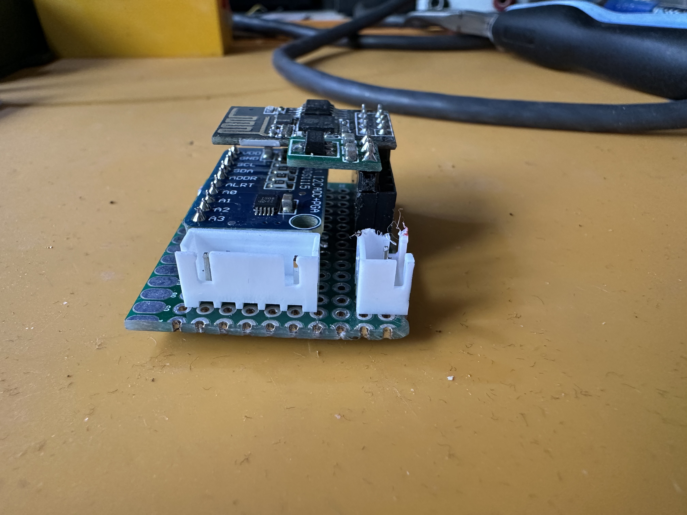 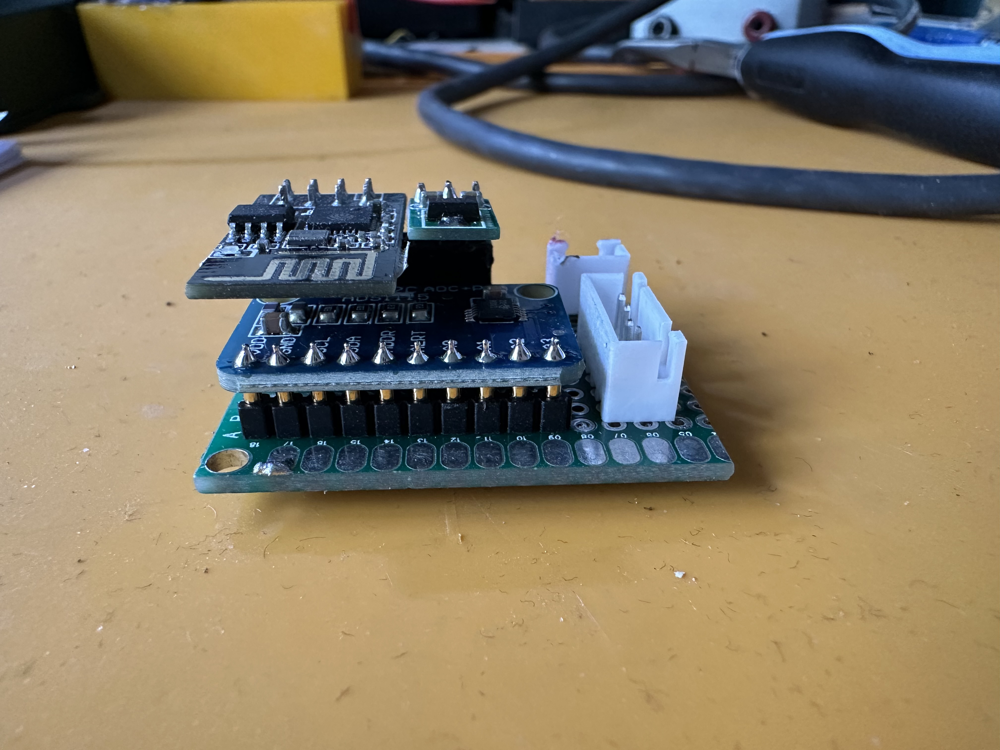

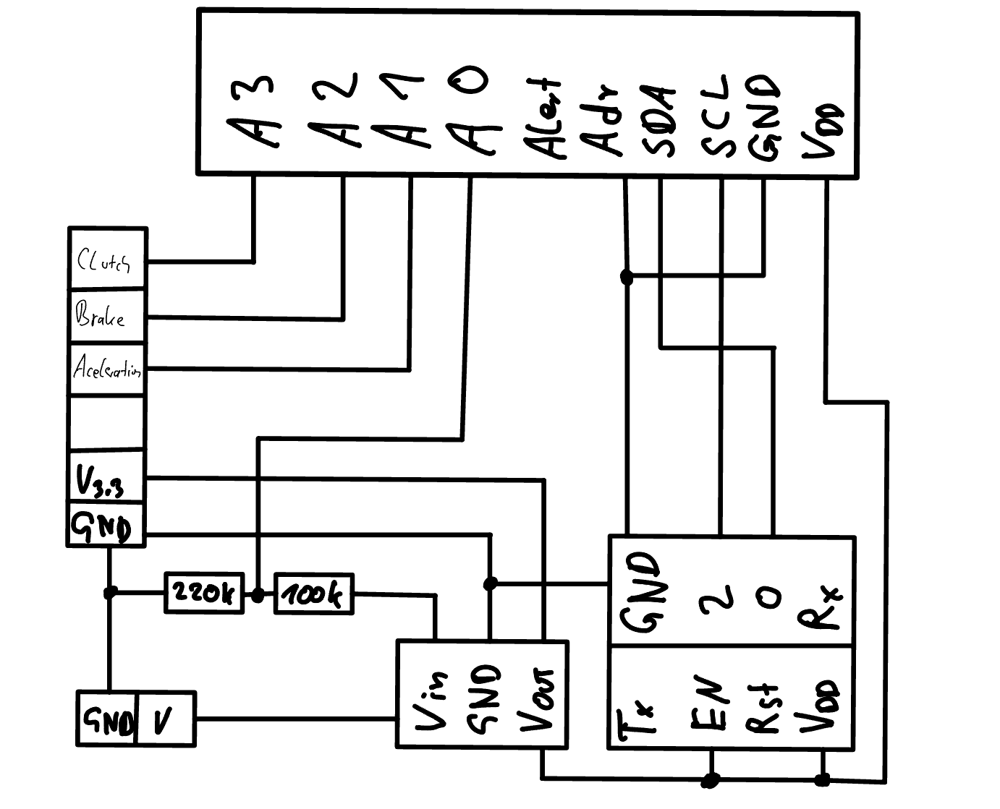

Die Pedale bestehen aus je einem 10kOhm Poti. Vom Lenkrad kommen 5V und GND und entsprechend wird an jedem Pedal die Signalspannung abgegriffen. Das ganze funktioniert natürlich auch mit 3,3V da wir ja nur die Position benötigen von 0-100% und einen Rohwert des AD Wandlers verschicken. Auf der Empfängerseite versuchen wir dann wieder so gut wie möglich 0-5V daraus zu machen. 
Den Ein-/Ausschalter habe ich direkt mit der Batteriemasse verbunden. Nicht ganz optimal weil dadurch auch nur im eingeschalteten Zustand der Akku geladen werden kann. Besser wäre es gewesen den Schalter in die Verbindung zur Hauptplatine zu bauen. Andererseits ist das dank Power Delivery Schaltung auch kein Problem zu den 1A Ladestrom auch die 150mA für die Schaltung zu bekommen. Deshalb habe ich es letztlich so gelassen. 
Die vorhandenen Kabel zum Lenkrad habe ich weitergenutzt. Den langen Teil abgeschnitten und einen Stecker für die Hauptplatine angeschlossen. Das war es dann auch auf Senderseite. Natürlich muss auf dem ESP-01 die Sendersoftware auch installiert werden. Wie das funktioniert setze ich voraus, hierfür gibt es aber auch genügend Anleitungen im Netz weshalb ich darauf nicht eingehe. Nur die MAC Adresse des Empfängers ist hart im Programmcode festgelegt und muss entsprechend angepasst werden. Man könnte natürlich auch Broadcast an alle ESP senden aber die Reichweite ist doch recht hoch und ich hab mich für die 1:1 Verbindung entschieden. 

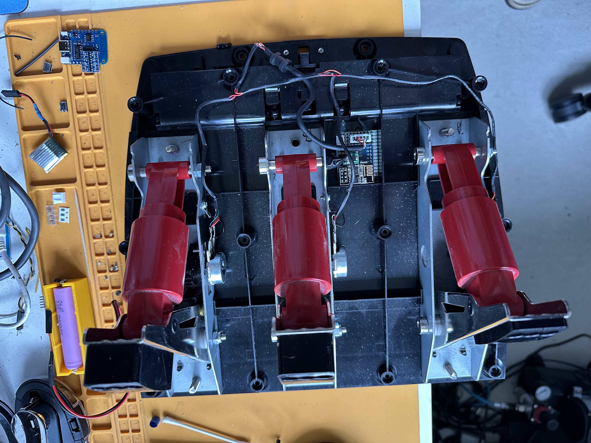 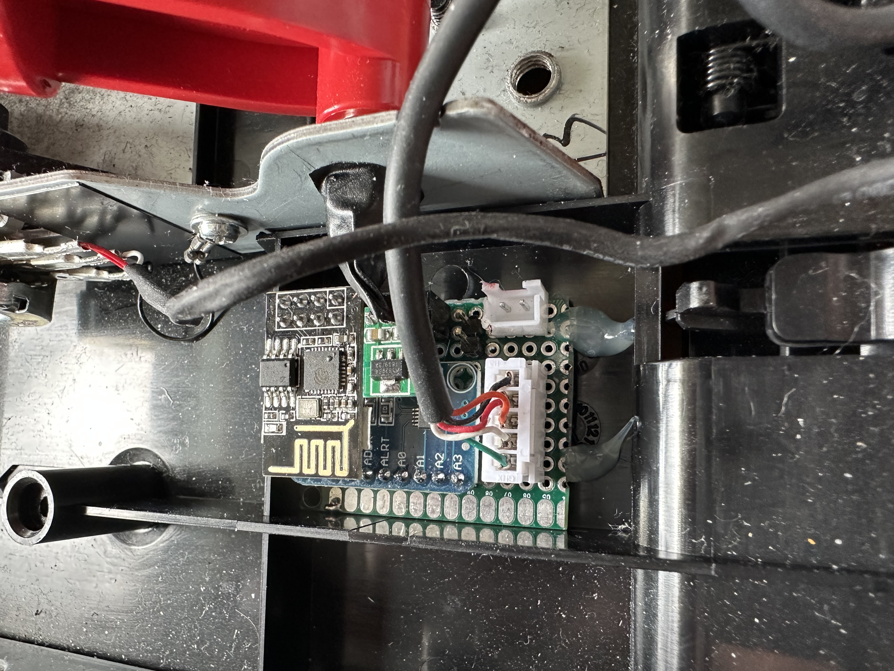 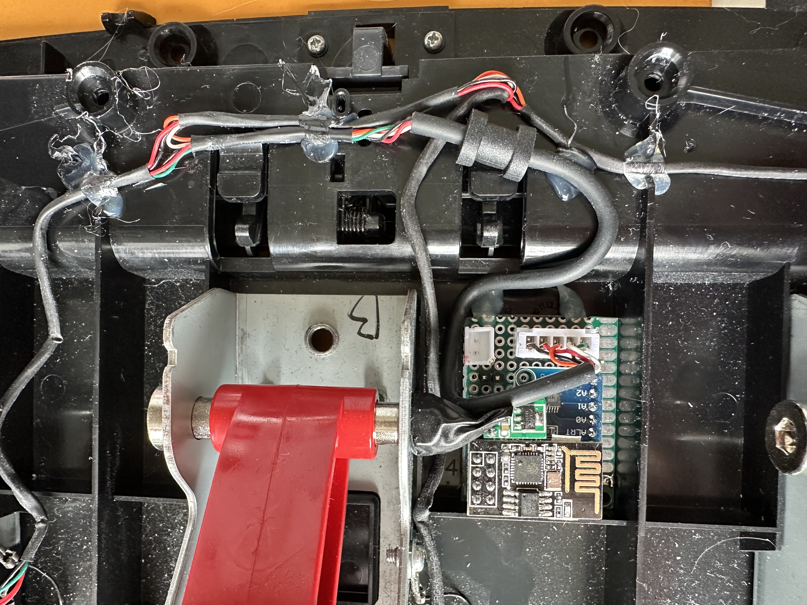 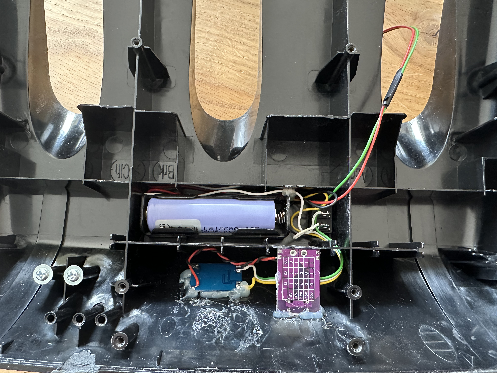 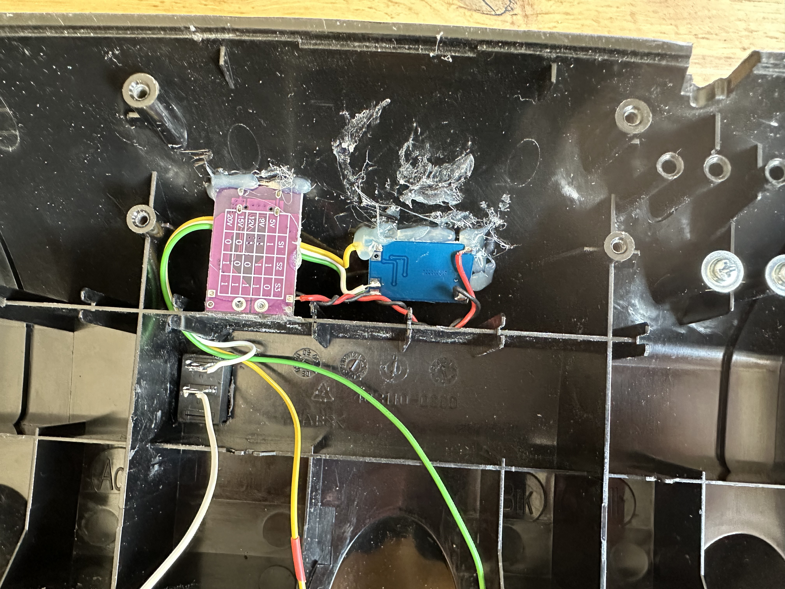 

Für die Lade-LEDs habe ich noch zwei 1,5mm Löcher ins Gehäuse gebohrt und anschliesend die Platine danach ausgerichtet und mit Heißkleber fixiert. 
Auch die Kabel sind mit Heißkleber fixiert und einige Stege aus dem Gehäusedeckel eingeschnitten um zu verhindern dass Kabel gequetscht werden. Beim Verschrauben kann man sonst leicht einige Kabel noch beschädigen. 

# Der Empfänger
Ein Wemos Klon gepaart mit einem Level Shifter schien mir hier die einfachste Wahl. Ganz so einfach war es dann aber doch leider nicht. Da ich davon augegangen bin dass der Prozessor im Lenkrad ein glattes Analogsignal sehen möchte und nicht die PWM Ausgänge eines ESP musste die Spannung nachträglich geglättet werden. Die bekannten Levelshifter sind aber sehr hochohmig (10kOhm) was ein RC Tiefpass einfach zu träge gemacht hat. Ich erreichte so aus dem PWM Signal mit 3,3V leider keine 5V. Tatsächlich gehen die 0-100% der Pedale in einer Spannung von 0,6V-4,6V aus, das hab ich im originalzustand vorher gemesssen. Aber auch von den 4,6V war ich noch weit weg. Ein funktionierender Tiefpass würde aus einem 1kOhm Widerstand in Reihe und 10µF Kapazität nach Masse bestehen. So ein Level Shifter hat aber von HV zum Ausgang einen 10kOhm Widerstand. 

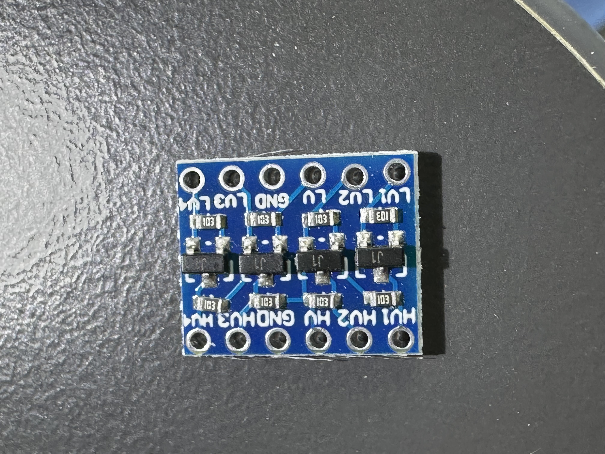

Um ausreichend Ladestrom für den 10µF Kondensator am 5V Ausgang zu erhalten habe ich parallel zu R4 im Schaltbild einen 1000 Ohm Widerstand gelötet. Das kann man auf der Lochrasterplatine machen zwischen 5V und dem Ausgang. Somit fällt R4 knapp unter 1000 Ohm. Der Entladestrom des Elkos wäre aber viel zu hoch für den I/O des Wemos weshalb unbedingt zwischen dem Ausgang und dem Elko noch mal 1kOhm in Reihe geschaltet sein muss. Das begrenzt den Strom auf 5mA was für den Wemos kein Problem ist. Das RC Glied besteht dann am Ende aus 2kOhm und 10µF. Immer noch gut genug die Spannung zu glätten und ein Maximum von circa 4,6V zu erreichen. Damit ist dann auch der Prozessor im Lenkrad zufrieden.

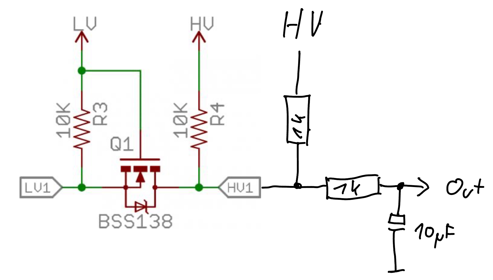

Ich habe leider versäumt ein schönes Foto vom Levelshifter zu machen aber ich habe ihn direkt auf der Platine unter dem Wemos verlötet. Daneben sind die SMD Elkos zu erkennen und die Widerstände habe ich auf der Rückseite verlötet.

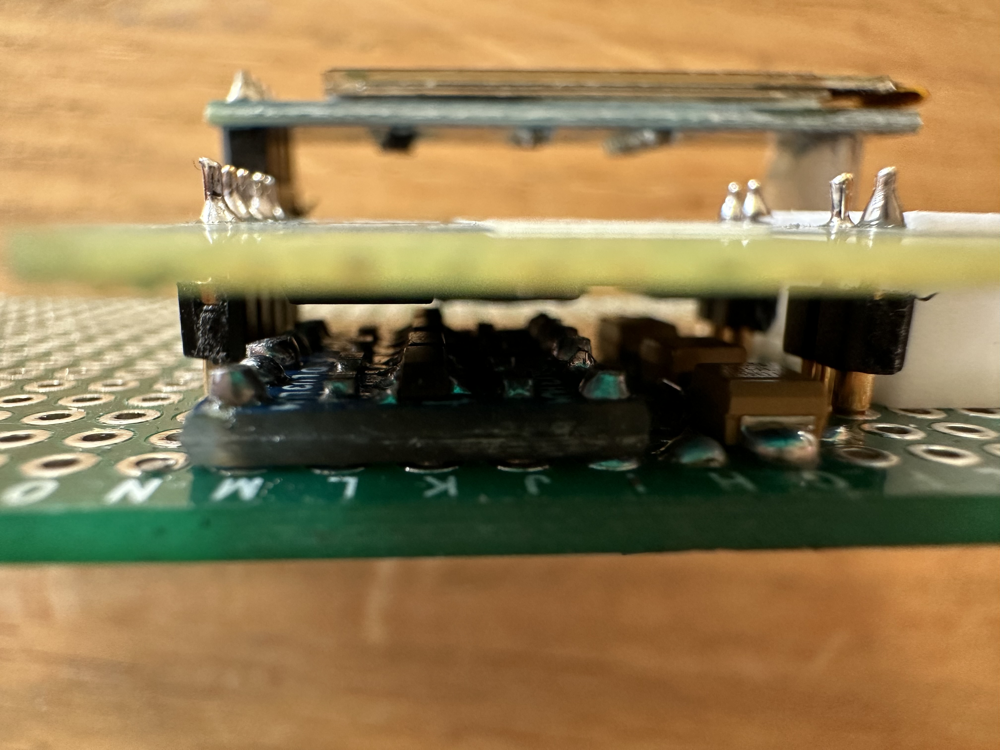 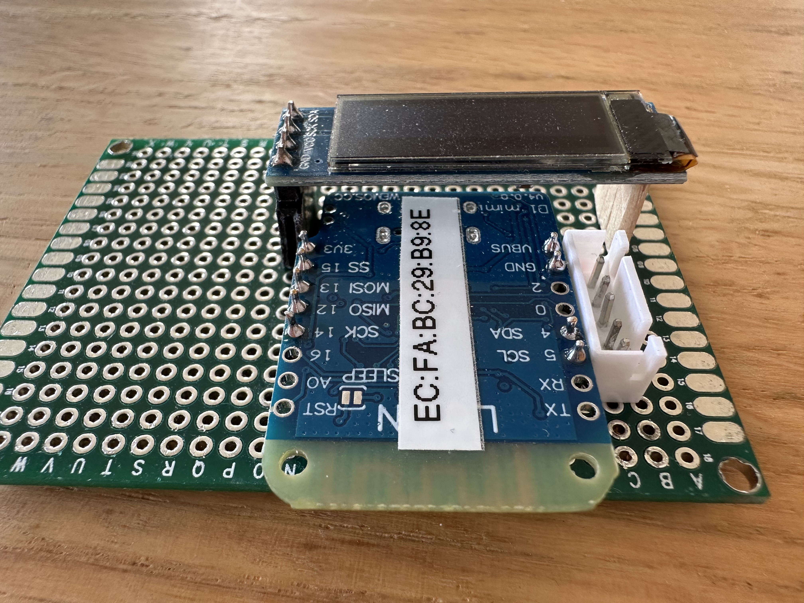
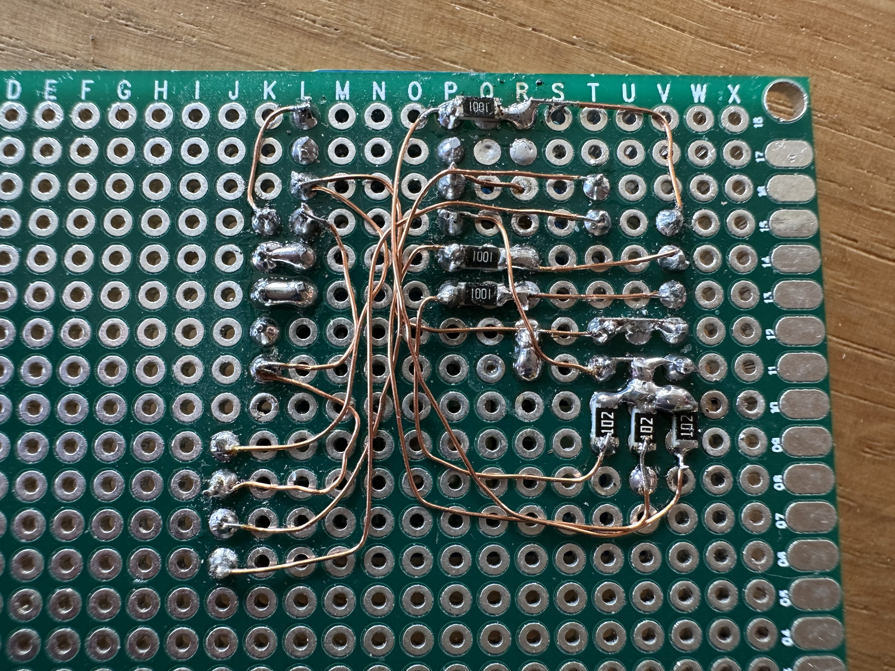 

Das OLED ist komplett optional und hier nur gesteckt. Später im Lenkrad habe ich das über eine 4-adrige Leitung verbunden. Es zeigt mir später die Spannung der Senderbatterie an und den Zustand des Gas- und Bremspedals, allerdings nur mit Latenz. Das PWM Signal reagiert unmittelbar auf die Pedale aber das Display schreibe ich im Code nur einmal pro Sekunde. Ohne zu überprüfen dachte ich mir die Rechenzeit des ESP ist besser aufgehoben möglichst schnell das PWM anzupassen und weniger das Display. Die einzige sinnvolle Information ist die Batteriespannung und die muss nicht unmittelbar angezeigt werden. 

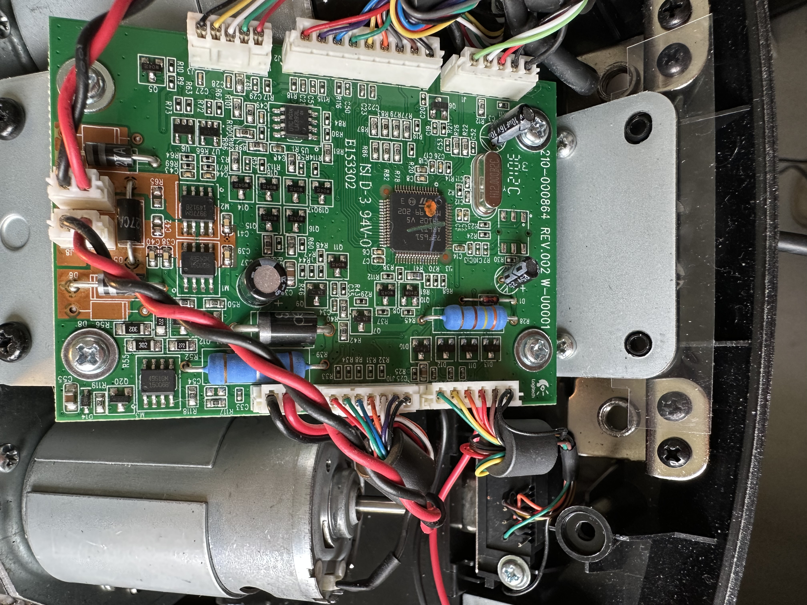

Der Anschluss der Pedale ist auf dem Mainboard unten links. Leider sind die Kabelfarben nicht identisch mit den Farben der Leitung zu den Pedalen. Gut wenn man sich vorher die Belegung vom Sub-D Stecker aufgeschrieben hat.

* 1 GND
* 2 Gas
* 3 Bremse
* 4 Kupplung
* 6 Enable Pin active high
* 9 +5V

Leider ist die Spannungsversorgung nicht ohne Schutzwiderstand und wir können die Schaltung nicht mit dem 5V Anschluss links betreiben. Die Spannung fällt augenblicklich auf 1V, ein Strom von 150mA kann hier nicht direkt abgegriffen werden. Deshalb habe ich die 5V direkt am USB Anschluss des Lenkrads abgegriffen, der grüne Pin am rechten Stecker. Hierfür brückte ich direkt auf der Rückseite mit einem Kupferlackdraht die Verbindung. Da auf den zwei Pins ohne Last dasselbe Potential lag machte ich mir über die Hauptplatine keine Sorgen. Vermutlich ist hier nur ein Schutzwiderstand eingebracht der die Platine vor einem Kurzschluss am Ausgang absichert der ja ohnehin nicht mehr benötigt wird. 

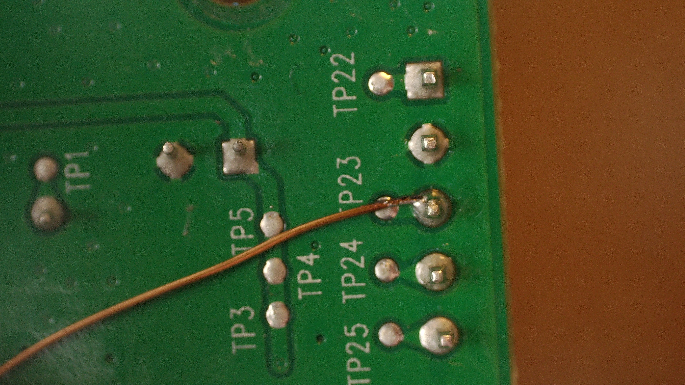 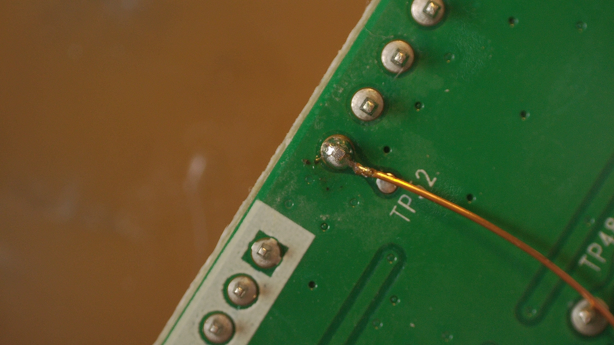 

Der braune Pin ist wohl eine Art Enabler. Die Pedale werden erst erkannt wenn auf diesem Pin High anliegt, also mit 5V verbinden. USB Plus ist grün und das Kabel ist braun?! Verlasst Euch nicht auf irgendeine Farbenregel, messt selbst nach. Auf dem Sub-D Kabel ist Pin 9 und 6 verbunden. 
Jetzt noch einen Platz für die Platine und optional das Display finden und wir sind fertig.

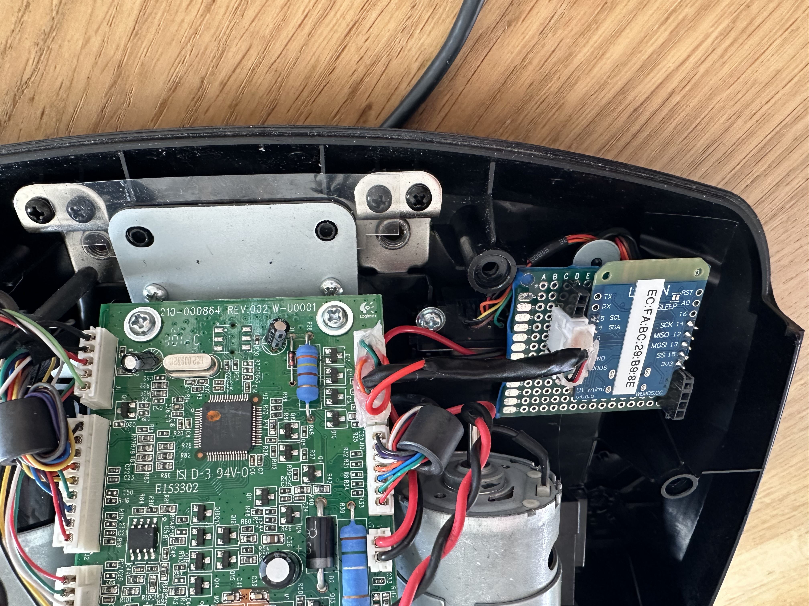 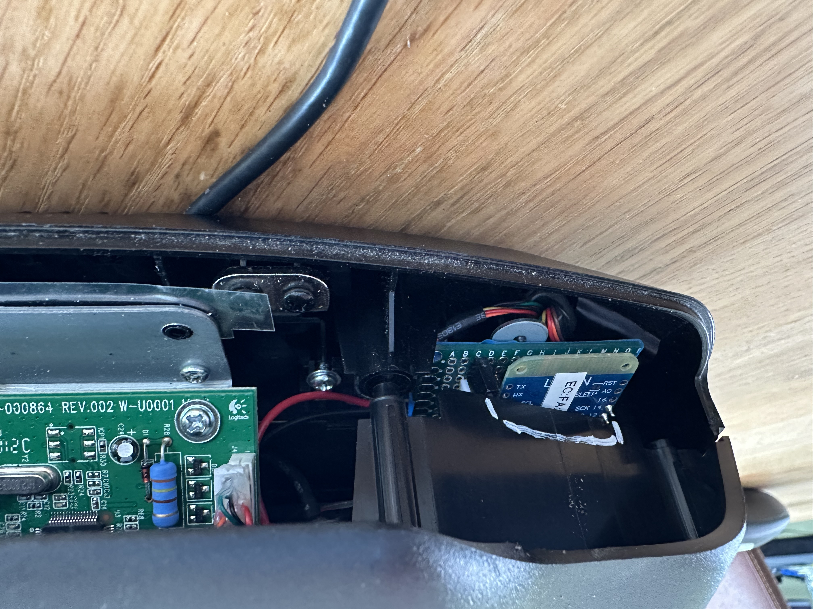 

Wie gesagt das Display ist komplett optional aber anders kann ich die Spannung des Akkus natürlich nicht anzeigen. Im Zweifel wäre halt irgendwann die Batterie leer, wer kennt es nicht von seiner Maus. Immer wenn es darauf ankommt müssen die Akkus gewechselt werden ;o) 
Weiter sollte man je nach Spiel immer überprüfen ob die Pedale auch wirklich 100% erreichen. Für GT7 kam ich manchmal nur auf 99,5% was man nicht haben möchte. Also vorher die Kalibrierung prüfen, es macht einen Unterschied. Die Reaktionsgeschwindigkeit ist hoch genug, man bekommt auf der Konsole in der Regel ja auch nicht mehr als 60fps und damit kann der ESP locker mithalten. Um ein wenig Strom zu sparen hab ich die Samplingrate auf 120/s begrenzt. Das spart circa 20% Strom und reicht aus meiner Sicht vollkommen aus. Man kann den Code natürlich auch anpassen um das Maximum heraus zu holen aber mehr als 215 kann der ADS1115 ohnehin nicht. 860 Samples geteilt durch 4 Kanäle.

Natürlich wäre auch eine fertige Platine schön gewesen aber wie es halt mal so ist - ich habe nur ein Lenkrad und der Prototyp funktioniert. Jeder Bastler weiß - nichts hält so lange wie ein Prototyp, sorry. Sollte es mich aber doch mal eines Tages reizen werde ich das nachliefern. Wartet aber bitte nicht darauf, da muss es mir schon sehr langweilig werden. Es war halt leicht mit dem Material was ohnehin bei mir rum fliegt etwas zu machen und die Breakout Boards vom China-Mann sind einfach unschlagbar günstig. 

